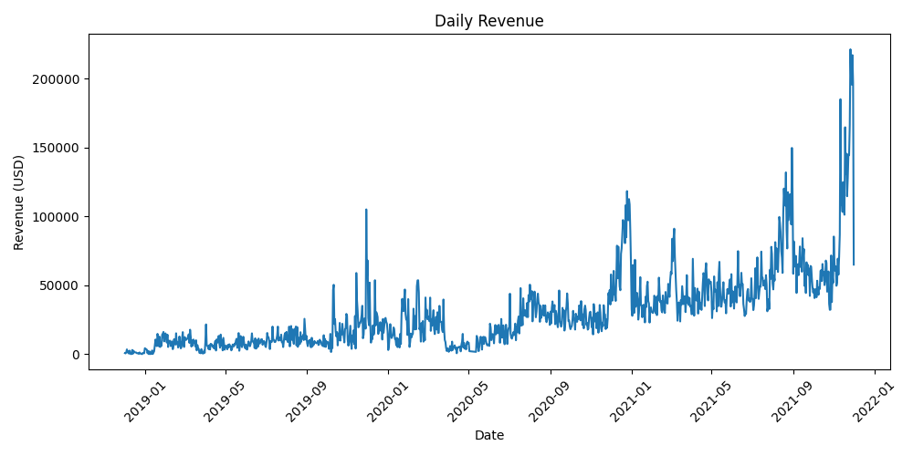

# Jewelry Sales Data Pipeline

## 🚀 Project Overview

This project implements an end-to-end data pipeline using Apache Airflow
and PostgreSQL to process jewelry transaction data.

The pipeline performs:

1.  Raw CSV ingestion
2.  Data cleaning and validation
3.  Loading structured data into PostgreSQL
4.  SQL-based analytical aggregations
5.  Automated generation of revenue charts

This project demonstrates practical data engineering concepts including
ETL orchestration, schema organization, data validation, and automated
analytics reporting.

------------------------------------------------------------------------

## 🏗 Architecture

Raw CSV ↓ Airflow DAG ↓ Data Cleaning (Pandas) ↓ PostgreSQL (Structured
Storage) ↓ Analytics Schema (Aggregations) ↓ Generated Charts (PNG)

------------------------------------------------------------------------

## 🛠 Tech Stack

-   Python
-   Apache Airflow
-   PostgreSQL
-   Pandas
-   Matplotlib

------------------------------------------------------------------------

## 📊 Pipeline Features

### 1️⃣ Data Cleaning

-   Automatic delimiter detection
-   Encoding-safe CSV reading
-   Column normalization
-   Type coercion (numeric & datetime)
-   Null handling and filtering
-   Derived metric creation:

```{=html}
<!-- -->
```
    total_amount = price_in_usd × quantity_of_sku_in_order

------------------------------------------------------------------------

### 2️⃣ Structured Data Storage

Data is loaded into PostgreSQL with schema separation:

-   `jewelry.sales` → Cleaned transactional data\
-   `analytics.daily_revenue` → Aggregated daily totals\
-   `analytics.top_categories` → Revenue by category\
-   `analytics.top_customers` → Top customers by spending

Schema separation helps isolate transactional data from analytical
outputs.

------------------------------------------------------------------------

### 3️⃣ Automated Analytics

After pipeline execution, the following charts are generated:

-   Daily Revenue Trend\
<p align="center">
  
</p>

-   Top 10 Categories by Revenue\
-   Top 10 Customers by Spend

Charts are stored in the `analytics_charts/` directory.

------------------------------------------------------------------------

## ⚙️ Configuration

The pipeline uses environment variables for configuration.

Example `.env` file:

    RAW_FILE_PATH=./jewelry.csv
    CLEAN_FILE_PATH=./jewelry_events_final_cleaned.csv
    POSTGRES_CONN_ID=postgres_conn

No hardcoded file paths are used.

------------------------------------------------------------------------

## ▶️ How to Run

1.  Configure Airflow
2.  Set required environment variables
3.  Place raw dataset in project directory
4.  Trigger DAG:

```{=html}
<!-- -->
```
    jewelry_simple_pipeline

After execution: - Cleaned dataset is generated - PostgreSQL tables are
created - Analytics charts are produced

------------------------------------------------------------------------

## 🧠 Engineering Highlights

-   Environment-based configuration (12-factor style)
-   Schema-based data organization
-   SQL aggregation layer
-   Automated analytics generation
-   Defensive CSV parsing logic
-   Clear task separation in Airflow DAG

------------------------------------------------------------------------

## 🔄 Future Improvements

-   Incremental loading instead of full refresh
-   Indexing strategy for performance optimization
-   Data validation framework (e.g., schema checks)
-   Structured logging instead of print statements
-   Containerized deployment
-   Unit testing
-   Monitoring and alerting

------------------------------------------------------------------------

## 📌 Purpose

This project was built to demonstrate practical ETL orchestration,
structured data storage, and analytical pipeline automation using modern
data engineering tools.
